# Mermaid

Mermaid renders diagrams from Markdown-inspired text. Obsidian renders ```` ```mermaid ```` fenced blocks natively (no plugin) since v0.13. This skill is the reference for valid syntax across diagram types and the gotchas that bite inside an Obsidian vault.

## When to Use

- The user asks for a flowchart, sequence diagram, ERD, state machine, gantt, mindmap, etc. inside a `.md` note.
- A note already contains a ```` ```mermaid ```` block that needs editing or fixing.
- The model is about to draw an ASCII diagram in a Markdown file → switch to Mermaid instead.
- Producing a diagram for a brief, decision record, or doc inside an `adjudant` vault.

## Core Rules

- **Always use a fenced block** with `mermaid` as the language: ```` ```mermaid ```` ... ```` ``` ````.
- **Diagram type goes on the first line inside the fence** (`flowchart LR`, `sequenceDiagram`, `erDiagram`, etc.).
- **One diagram per fence.** Multiple fences in the same note is fine.
- **Quote labels with special characters** (colons, parens, `<`, `>`, `#`, `"`): `A["Some: label (v2)"]`.
- **Wikilinks (`[[note]]`) do NOT work inside Mermaid.** Use external URL clicks: `click NodeId "https://..."`.
- **Long labels** — wrap with `<br>` for explicit line breaks. (NOT `<br/>` — XHTML self-closing form is unreliable across Mermaid versions.)
- **Comments** inside Mermaid: `%% this is a comment` (not `//` and not `#`).

## Generation discipline (READ THIS BEFORE GENERATING)

When **producing** new diagrams (not just understanding existing ones), follow the discipline in [`mermaid-generation-rules.md`](mermaid-generation-rules.md). Eight rule groups covering:

1. **Topology** — one terminal per path, pure DAGs only, mirror parallel branches, no hub nodes, avoid subgraphs for layout grouping
2. **Label parser safety** — quote always, no markdown-list prefixes, `<br>` not `<br/>`, escape `<>&`
3. **Label visual cleanliness** — uniform width, two-line max, terse edge labels
4. **Direction heuristics** — when `TD` vs `LR` vs `stateDiagram-v2` vs `sequenceDiagram`
5. **Styling** — one `classDef` per role, palette ≤6, role stamped at generation time
6. **Renderer config** — front-matter config preferred over `%%{init}%%`, default Dagre layout
7. **Anti-patterns to refuse** — single End with >2 inbound, hub nodes >5 edges, etc.
8. **Validation** — pre-flight parse + anti-pattern check before write

This file covers syntax; `mermaid-generation-rules.md` covers taste and discipline. Both apply when generating.

**Generated diagrams**: for diagrams derived from vault data — the project's wikilink relations, a board snapshot, the three-tier cleanup model — don't hand-draw. `scripts/graph.py` emits a node-capped fence with quoted labels and role classDefs (review its topology against the rules' §1/§7 before pasting):

```bash
python3 .../scripts/graph.py --project-dir "$PROJECT_ROOT" --mode relations   # wikilink graph
python3 .../scripts/graph.py --project-dir "$PROJECT_ROOT" --mode board      # kanban snapshot
python3 .../scripts/graph.py --mode tiers                                    # tidy→ramasse→dream
```

## Diagram Types — Quick Reference

### Flowchart (most common)

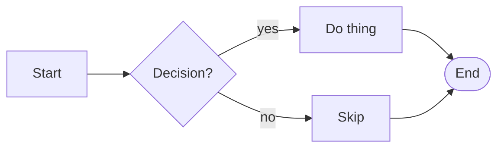

Directions: `TB` (top-bottom), `TD` (same), `BT`, `LR` (left-right), `RL`.

Node shapes: `[rect]`, `(round)`, `([stadium])`, `[[subroutine]]`, `[(cylinder)]`, `((circle))`, `>asymmetric]`, `{rhombus}`, `{{hexagon}}`, `[/parallelogram/]`, `[\trapezoid\]`.

Edge styles: `-->` (arrow), `---` (line), `-.->` (dotted), `==>` (thick), `--text-->`, `-->|label|`, `~~~` (invisible link).

Subgraphs:
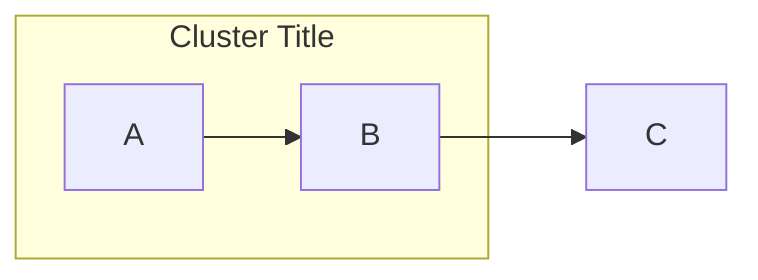

### Sequence Diagram

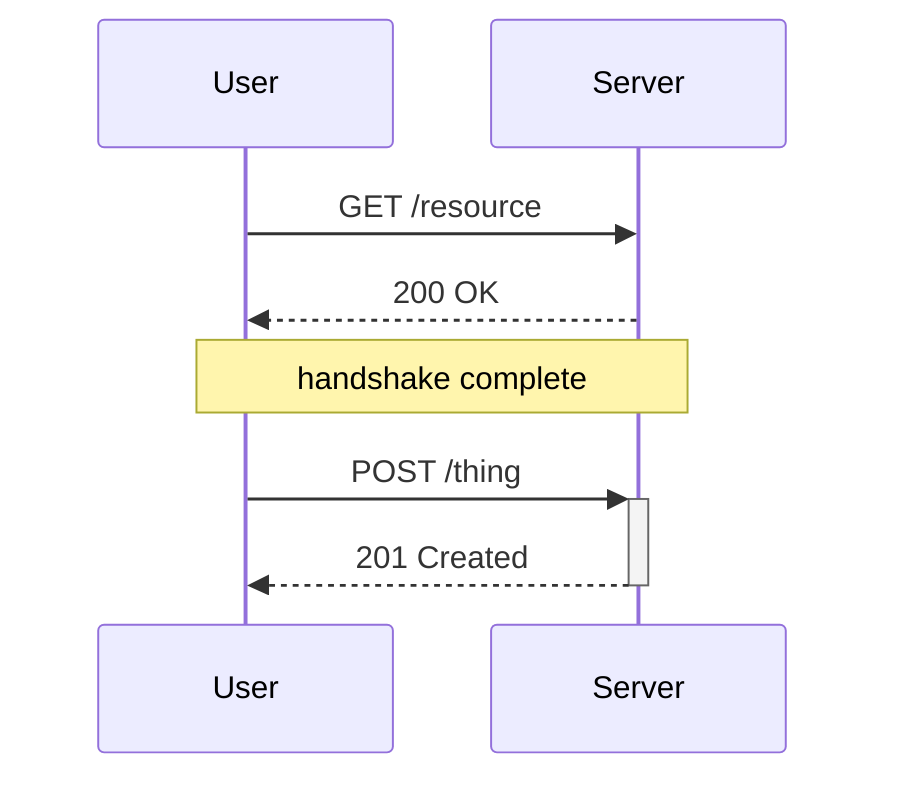

Arrows: `->>` (solid), `-->>` (dashed), `-x` (cross), `--x`, `-)` (open async).
`activate`/`deactivate` (or `+`/`-` shorthand on arrows) shows lifelines.

### Class Diagram

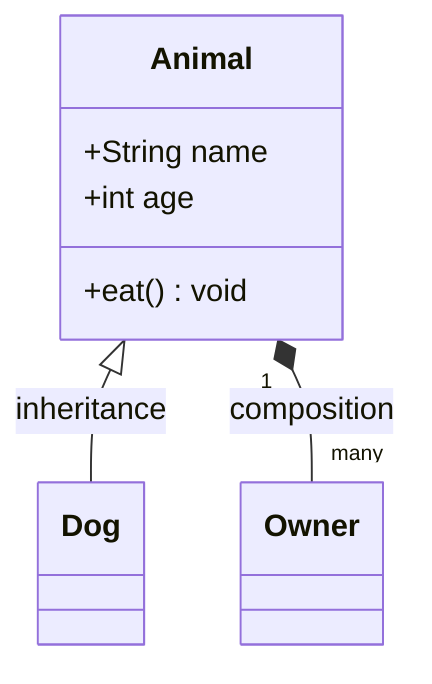

Relations: `<|--` (inherit), `*--` (composition), `o--` (aggregation), `-->` (assoc), `..>` (depend), `..|>` (realize).

### State Diagram

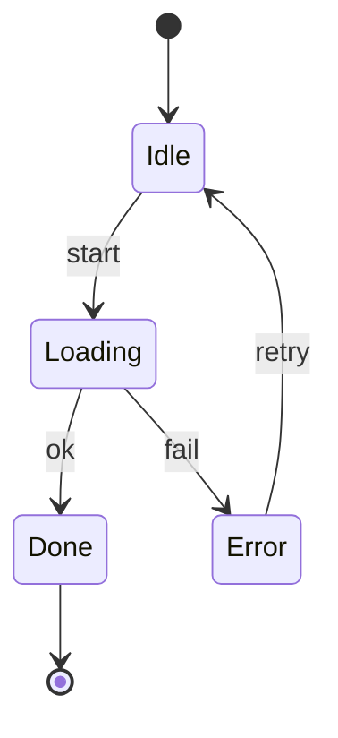

Composite states with `state X { ... }`. Forks/joins via `<<fork>>`, `<<join>>`.

### Entity-Relationship (ERD)

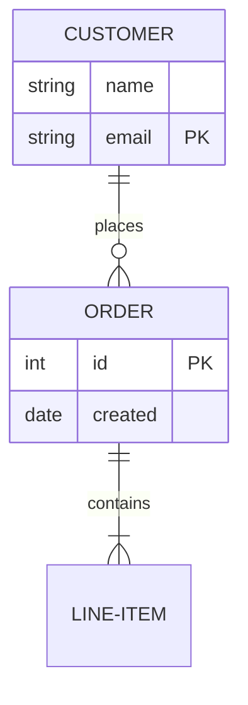

Cardinality glyphs: `|o` (zero or one), `||` (exactly one), `}o` (zero or many), `}|` (one or many). Mirror on each side.

### Gantt

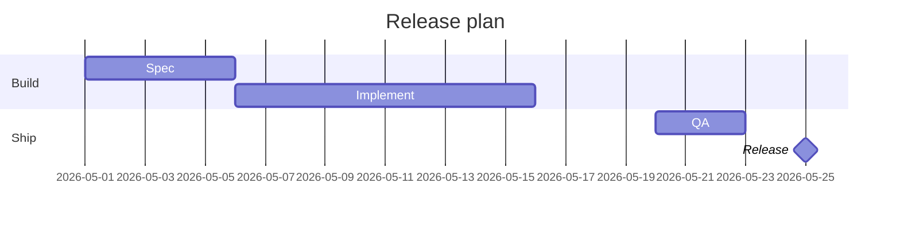

### Mindmap

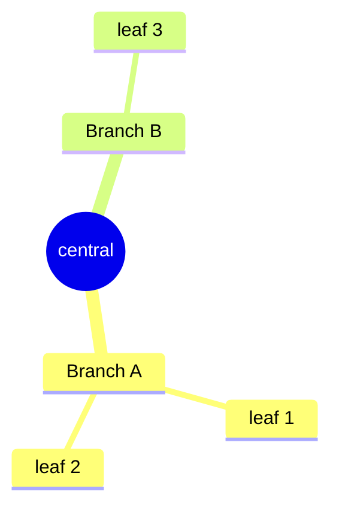

Two-space indentation defines hierarchy. Root shapes: `(round)`, `((circle))`, `))cloud((`, `)bang(`.

### Timeline

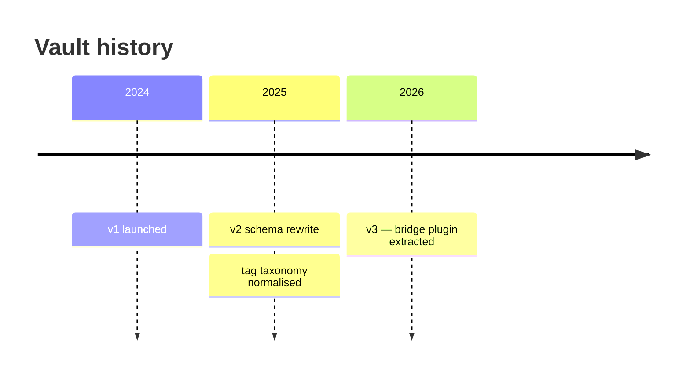

### Git Graph

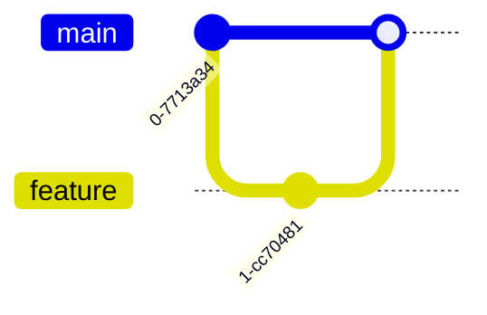

### Pie

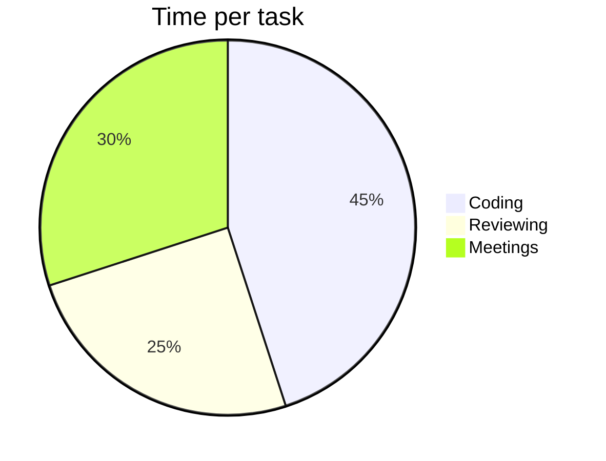

### Quadrant Chart

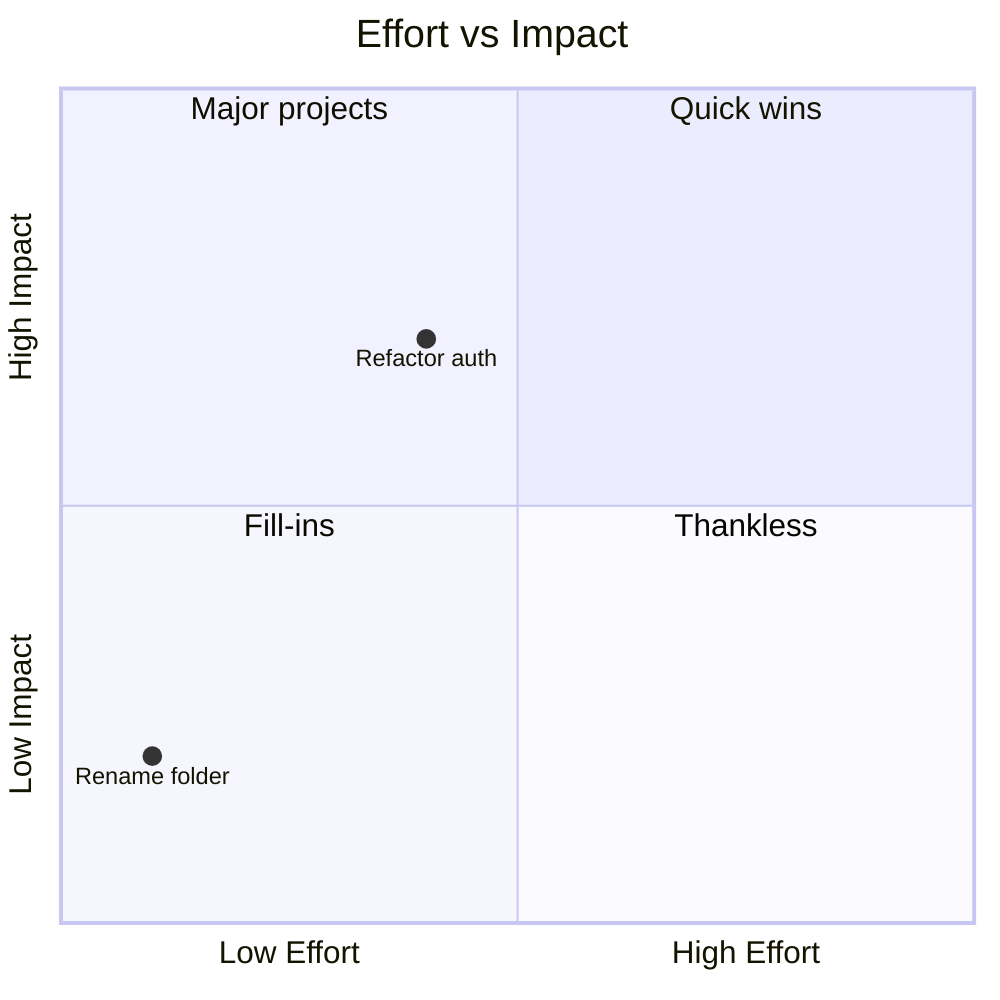

### User Journey

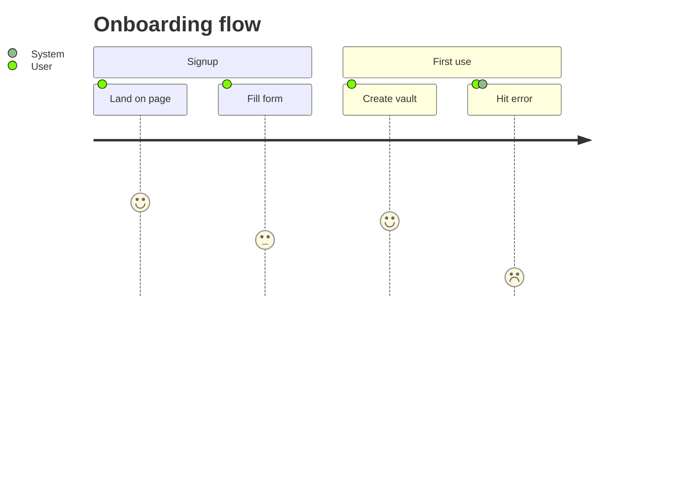

Score scale 0–5 per actor; multiple actors comma-separated.

### C4 (Context / Container / Component)

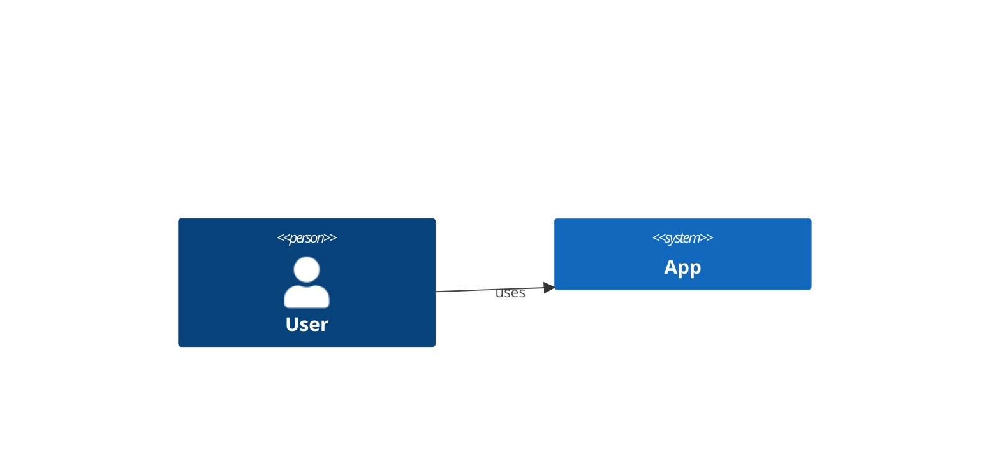

Variants: `C4Context`, `C4Container`, `C4Component`, `C4Dynamic`. Experimental upstream — keep them small (see Size & complexity below).

## Obsidian-Specific Notes

- **Native rendering, no plugin needed.** Works in reading view, live preview, and exported PDFs.
- **Theme follows Obsidian theme.** Light/dark switches automatically. When a per-diagram override is truly needed, prefer front-matter config inside the fence (```` ```mermaid ```` then `---` / `config: …` / `---`) over the legacy `%%{init: {...}}%%` directive — and usually leave theme alone for vault consistency (rules §6).
- **Wikilinks are NOT parsed inside Mermaid**, but flowchart nodes can link to vault notes natively:
  `click A "Note Name"` plus `class A internal-link` (flowchart only; works in reading view).
  **Avoid `obsidian://open?vault=...` URIs** — they hardcode the vault name and dead-end on the
  other machine or after a vault rename. A plain wikilink under the diagram is the portable fallback.
- **Embedded diagrams (`![[other-note]]`)** that contain Mermaid will render in the embedding note.
- **Inside callouts** Mermaid still renders, but indentation must be preserved per callout block.

## Size & complexity

- **~25–30 nodes per fence, maximum.** Obsidian renders mermaid in-note; big graphs stutter live
  preview and become unreadable at note width. Split by theme, or escalate to a Canvas
  (`content-canvas.md`) when the graph should be pannable.
- `graph.py --mode relations` enforces the cap mechanically (`--max-nodes`, default 30) and says
  what it dropped — prefer it over hand-drawing large graphs.
- **Per-type support caveats**: `timeline`, `quadrantChart`, and `mindmap` need a reasonably
  recent Obsidian (older bundled mermaid versions render them as raw text); `C4Context` and
  friends are experimental upstream — expect layout quirks and keep them small.

## Common Pitfalls

| Symptom | Cause | Fix |
|---|---|---|
| Diagram shows as raw text | Wrong fence language tag | Must be exactly `mermaid`, lowercase |
| `Syntax error in graph` at first line | Diagram-type keyword missing or misspelled | First line inside fence is `flowchart LR` (etc.) |
| Labels with `:` or `()` break parsing | Unquoted special chars | Wrap in `"..."`: `A["Label: with colon"]` |
| Edge label disappears | Wrong syntax | Use `-->|label|` not `-- label -->` for flowchart |
| Wikilink renders as literal text | Not supported | `click NodeId "Note Name"` + `class NodeId internal-link` (flowchart), or a wikilink below the diagram |
| Sequence diagram lifelines don't show | Missing `activate`/`+` | Use `->>+ S` and `-->>- U` shorthand |
| ERD cardinality wrong | Glyph mirrored incorrectly | Left of `--` = left entity's perspective |
| Gantt `dateFormat` mismatch | Format string doesn't match dates | Default is `YYYY-MM-DD`; set explicitly if other |
| Mindmap nodes flatten | Inconsistent indentation | Use exactly 2 spaces per level, no tabs |
| Theme variables ignored | `%%{init}%%` syntax wrong | Must be the very first line, valid JSON5 |

## When NOT to Use Mermaid

- One-node "diagrams" — use a sentence.
- Free-form sketches, illustrations — use an image (`![[diagram.png]]`).
- Real architecture diagrams meant for stakeholders — consider a dedicated tool (Excalidraw, Draw.io) and embed the result.
- Anything where layout precision matters — Mermaid is auto-laid-out; you cannot pin positions in most diagram types.

## Cross-References

- Generation discipline: `mermaid-generation-rules.md` (always applies when producing new fences).
- Generated-from-vault diagrams: `scripts/graph.py` (relations / board / tiers).
- Broader Obsidian-flavored Markdown context: `content-markdown.md`.
- Pannable large graphs: `content-canvas.md`.
- Upstream syntax canon: <https://mermaid.js.org/intro/>.
